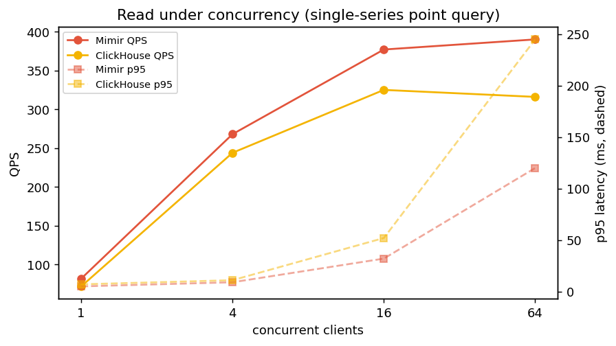
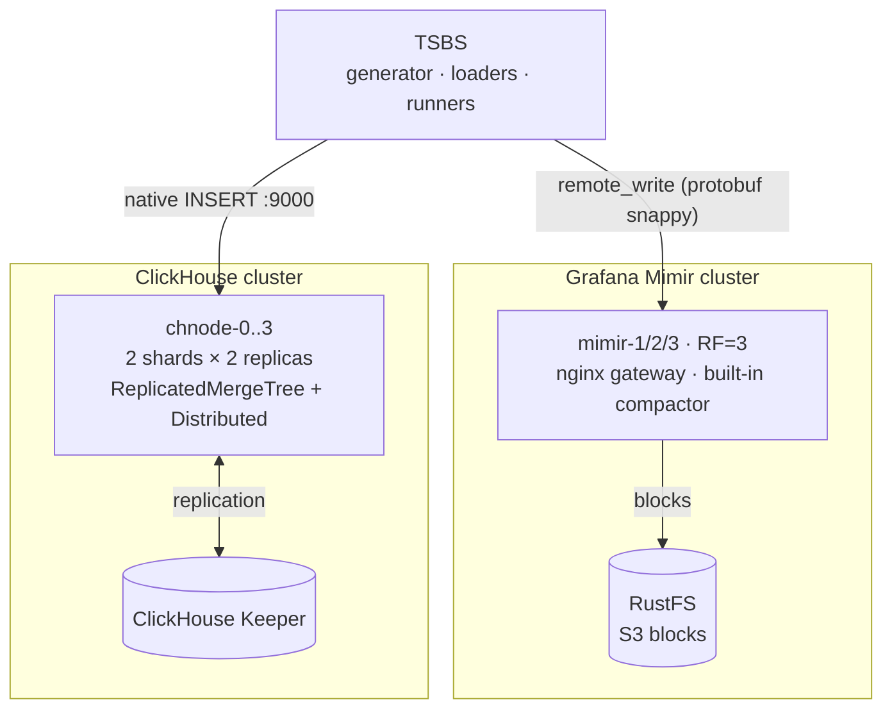

# Benchmark Mimir vs ClickHouse

Local sandbox to compare, under equivalent load, a Prometheus-compatible TSDB
(**Grafana Mimir**, clustered) and **ClickHouse** (clustered) on:

- **write speed** (ingestion),
- **read speed** (queries),
- **maintenance operations**: compaction, replication and **replica rebuild**.

The benchmark engine is [TSBS](https://github.com/timescale/tsbs) (use-case `cpu-only`),
which generates **a single dataset** injected into both systems for a fair comparison.

A **multi-node** variant lives in **[`v2/`](v2/README.md)**: the same benchmark on OVH Managed
Kubernetes with ClickHouse and Mimir on separate machines, provisioned with OpenTofu.

## Contents

**Findings:** [The experiment](#the-experiment) · [Results](#results) · [Caveats](#caveats) ·
[Verdict](#verdict) · [TODO / possible improvements](#todo--possible-improvements)

**Running it:** [Topology](#topology) · [Prerequisites](#prerequisites) ·
[Quick start](#quick-start) · [On Kubernetes](#on-kubernetes-recommended-for-the-1-bn-run) ·
[Configuration](#configuration-env) ·
[Three important subtleties](#three-important-subtleties-already-handled) ·
[ClickHouse cluster operations lab](#clickhouse-cluster-operations-lab) ·
[Where to read the results](#where-to-read-the-results) · [Cleanup](#cleanup)

## The experiment

One dataset, generated once by TSBS (`cpu-only`, 10,000 hosts, 30 hours at a 10s interval),
loaded into both systems: a ClickHouse cluster (2 shards, 2 replicas each, plus one Keeper node)
and a Mimir cluster (3 monolithic replicas, replication factor 3, with RustFS as the S3 object
store). TSBS was compiled from source inside the cluster, so no private registry was involved.

### Test environment

A single Talos Linux node acting as both control plane and worker (no taint, so workloads
schedule on it). It is a shared cluster: dozens of other namespaces were live during the run
(ArgoCD, KubeVirt, SigNoz, monitoring, and so on), so the benchmark did not have the machine to
itself.

| Property | Value |
|---|---|
| Kubernetes | v1.35.6 |
| OS | Talos Linux v1.13.5 |
| Kernel | 6.18.36-talos |
| Container runtime | containerd 2.2.5 |
| Architecture | amd64 |
| CNI | Cilium (with cilium-envoy and cilium-operator) |
| CPU | 12 vCPU |
| Memory | 125.7 GiB |
| Ephemeral storage | 417.8 GiB |

The benchmark was driven from a macOS laptop over `kubectl`. TSBS ran inside its pod, launched
detached with `setsid` so the long generation and ingestion steps survived any `kubectl exec`
disconnection. The ClickHouse cluster operations were driven from the laptop too, since they
need `kubectl` to reach individual pods.

**Storage.** Every component uses `emptyDir` on the node's ephemeral disk. No persistence is
needed for a throwaway run, and it keeps the benchmark off the shared storage pool.

Software versions:

| Component | Version |
|---|---|
| ClickHouse server and Keeper | 24.8 |
| Grafana Mimir | 2.13.0 |
| RustFS | latest |
| `minio/mc` (bucket init) | latest |
| TSBS | built from `master` (Go 1.22, bookworm) |
| busybox (init container) | 1.36 |

Deployed components, all under the `bench-prom-ch` namespace (labelled `privileged` for Pod
Security):

| Component | Pods | CPU request | CPU limit | Mem limit | Working dir (emptyDir) |
|---|---|---|---|---|---|
| ClickHouse (`chnode`) | 4 | 500m | 3 | 8 GiB | 40 GiB |
| ClickHouse Keeper | 1 | 100m | 1 | 1 GiB | 5 GiB |
| Mimir | 3 | 500m | 3 | 16 GiB | 60 GiB |
| RustFS | 1 | 100m | 2 | 4 GiB | 30 GiB |
| TSBS | 1 | 500m | 6 | 10 GiB | 40 GiB |

Mimir ran with replication factor 3, memberlist for its rings, a 40h out-of-order window, and
(after the read fix) its per-query fetch limits set to unlimited. ClickHouse ran as 2 shards of
2 replicas, coordinated by the single Keeper node, with the legacy `MergeTree` syntax allowed so
the TSBS schema would load. Pod CPU, memory, network and filesystem metrics came from the
cluster's existing `signoz-k8s-infra` OTel collector, queried through SigNoz.

## Results

All figures are for the same 1.08 billion points (108 million rows, 10 metrics per row).

### Charts

Generated by `scripts/plots.py` (matplotlib) from the measured numbers.

| | |
|---|---|
|  |  |
|  |  |
|  |  |

### Write

Measured paths for the same 1.08 billion points:

| Path | Duration | Throughput | Replication |
|---|---|---|---|
| ClickHouse, client ingest (TSBS) | 273 s | 3.95 M points/s | single node, RF=1 |
| ClickHouse, cluster write RF=2 (INSERT SELECT into Distributed) | +48 s † | ~22 M points/s (server-side) | 2 shards × 2 replicas ‡ |
| ClickHouse, cluster write RF=3 (INSERT SELECT, replicate) | +82 s † | ~13 M points/s (server-side) | 1 shard × 3 replicas ‡ |
| Mimir, backfill (out-of-order), 3-node cluster | 5,270 s | 205 k points/s | 3 nodes, RF=3 |
| Mimir, real-time in-order (now-anchored, 72M points) | 355 s | 203 k points/s | 3 nodes, RF=3 |
| Mimir, single instance (monolithic) | 3,645 s | 296 k points/s | 1 instance, RF=1 |

† `+N s` is additional server-side work on top of the 273 s client ingest (the INSERT SELECT that
shards and replicates the already-loaded rows), not a standalone run.
‡ Both are layouts of the same 4-node ClickHouse cluster: RF=2 uses 2 shards × 2 replicas (all 4
nodes); RF=3 uses 1 shard × 3 replicas (3 of the 4). Throughput is in distinct points/s, so the
RF=3 figure looks lower because the same 82 s writes a third full copy (324M row-copies).

**Equal replication (RF=3).** Replicating ClickHouse to RF=3 (108M rows to three replicas,
324M row-copies) took 82 s of server-side work on top of the client ingest, so a fully RF=3
ClickHouse lands the **full 1.08 B points** in roughly 355 s and about 590 core-seconds. Even at
the same RF=3 as Mimir, that is ~15x faster and ~49x cheaper in CPU than Mimir's cluster run. The
RF asymmetry is not what drives the gap.

(Watch the table: the Mimir real-time row is also 355 s, but that is for a 72M-point now-anchored
slice, not the full dataset. Full-scale Mimir at 203 k/s would take ~5,300 s, in line with the
backfill. The two 355 s figures are a coincidence, not parity.)

Read the ClickHouse and Mimir rows with the asymmetry in mind (see Caveats): the ClickHouse
client path is single node, and its cluster writes are server-side INSERT SELECT with no client
protocol, while Mimir ingests over remote-write. Two findings hold:

- **The ~205 k/s ceiling is remote-write plus RF=3 bound, not out-of-order or timestamp mode.** A
  genuine real-time, in-order write (a now-anchored dataset, ingested to the RF=3 cluster) ran at
  203 k/s, within 1% of the out-of-order backfill's 205 k/s. Out-of-order only cost memory: the
  first run ballooned the ingester working set and was evicted at 20 GiB (fixed by the 60 GiB
  working directory). The single-instance run (RF=1) hit 296 k/s, so RF=3 is ~1.5x of the ceiling
  and the rest is the per-sample remote-write path.
- **More client concurrency does not raise the ceiling.** A sweep at 8, 16, 32 and 48 workers
  stayed flat around 180-188 k samples/s while Mimir's own CPU climbed from ~3.2 to ~5.1 cores.
  Extra concurrency buys CPU burn, not throughput. The wall is server side: ingester CPU plus the
  RF=3 write amplification (every sample stored three times). Scaling Mimir writes means more
  ingester and distributor replicas, not more clients.

Adding full RF=2 sharding and replication to ClickHouse costs only ~48 s of server-side work on
top of the ingest, so even a replicated ClickHouse finishes the volume in minutes rather than the
~88 minutes Mimir takes at RF=3.

### Storage

| | ClickHouse | Mimir (RustFS blocks) |
|---|---|---|
| On disk, one copy | 3.04 GiB (4.2x compression) | 6.0 GiB |
| On disk, as replicated | ~6.08 GiB (RF=2) | 6.0 GiB (one compacted copy, S3-durable) |

Measured after `OPTIMIZE TABLE ... FINAL` (fully compacted, 1 part). Before the forced merge the
table sat at ~2.7 to 2.9 GiB across 12 background-merged parts, so compaction did not shrink it;
if anything it grew slightly (larger blocks compress marginally worse for this data). The earlier
"2.88 GiB" was not an under-count from unmerged parts.

The real ClickHouse win here is **compression** (~4.2x): one copy is ~2x smaller than Mimir's
blocks. Total footprint is a different story and depends on the durability model. ClickHouse
stores RF=2 on cluster disks (~6.08 GiB), while Mimir keeps a single compacted copy in object
storage and leans on S3 for durability. Counting replication, the two are essentially equal
(~6 GiB each), so don't read the 3-vs-6 gap as a 2x storage saving.

### Resource consumption during the write (from SigNoz)

| | ClickHouse | Mimir |
|---|---|---|
| CPU, client ingest (single node) | ~1.45 cores on the busiest node | not applicable |
| CPU, cluster write | ~2.3 cores across 4 nodes (RF=2 INSERT SELECT) | ~5.5 cores across 3 pods |
| Peak memory | ~1.0 GiB (busiest node) | ~0.9 GiB per pod |
| CPU-time for the full dataset | ~590 core-seconds (ingest + RF=3 replicate) | ~28,700 core-seconds (RF=3) |

At equal replication (RF=3 on both sides), Mimir spent ~49x more CPU-time than ClickHouse for the
same data (~590 vs ~28,700 core-seconds). Since the RF is now equal, that whole gap is
architectural, not replication: the per-sample remote-write path (protobuf, RF fan-out, TSDB head)
against columnar batch inserts. (Measured directly, the ClickHouse ingest + RF=2 replicate was
~500 core-seconds; the +90 to RF=3 is the third copy.)

To separate the cost of clustering from the engine itself, a single-instance monolithic Mimir
(RF=1, no gossip) was also run: it ingested at 296 k/s using ~10,800 core-seconds, versus the
3-node RF=3 cluster's 205 k/s and ~28,700 core-seconds. So dropping clustering and RF=3 makes
Mimir about 1.4x faster and ~2.6x cheaper, but it is still ~18x the CPU-time of the RF=3 ClickHouse.
Most of the gap is the engine and protocol, not the cluster. (See `k8s/40-mimir-mono.yaml`.)

### Continuous ingestion and ClickHouse's merge tax

The bulk write above uses large batches, a best case for ClickHouse: few parts, little merging.
A metrics-like continuous stream is many small writes, which create many small parts that
ClickHouse then merges in the background. Loading the same 1.44M-row slice both ways
(`scripts/merge_tax.sh`):

| Batch size | Wall time | Parts created | Merges | Merge CPU-time |
|---|---|---|---|---|
| 10,000 (bulk) | 4 s | 144 | 25 | 2.8 s |
| 200 (scrape-like) | 16 s | 7,344 | 1,257 | 29 s |

Small batches create ~50x more parts and ~10x more merge work, and the load is ~4x slower. So the
headline bulk write numbers understate ClickHouse's steady-state cost under continuous small-write
ingestion.

At full scale (`scripts/steady_state.sh`, the whole 108M rows at batch 200, sampled every 20 s for
~35 minutes):

| | Bulk (batch 10k) | Continuous (batch 200) |
|---|---|---|
| Throughput | 3.95 M points/s | 510 k points/s |
| Parts created | ~hundreds | 540,050 |
| Merges run | tens | 73,755 |
| Merge CPU-time | seconds | ~2,527 core-seconds |

Two things stand out. First, throughput drops ~7.7x (small parts, constant merging), so the write
gap versus Mimir narrows from ~19x to ~2.5x under a scrape-like pattern (510k vs 205k points/s).
Second, ClickHouse reaches a genuine steady state: active parts stayed bounded (median 30, max 48)
across the whole run while merges ran continuously, so it kept pace rather than falling behind, at
the cost of ~2,500 core-seconds of background merge work. batch=200 is a deliberate worst case; a
real deployment would use `async_insert` or a buffer to batch writes and avoid the part explosion.
It is still faster than Mimir, but this is the honest continuous-ingestion picture, not the bulk
best case.

### Read (mirrored queries, correct metric names, 10,000 hosts / 100k series)

Both engines timed the same way: over HTTP, including result serialization and transfer (Mimir
`query_range`/JSON, ClickHouse HTTP interface with `FORMAT JSONCompact`). p50/p95 in ms over 10
runs after 2 warm-ups. See `scripts/read_gradient.sh`.

| Query | Mimir (p50/p95) | ClickHouse (p50/p95) | Gap (p50) |
|---|---|---|---|
| Single series (1 host, 1 metric, 1h) | 4 / 6 ms | 6 / 7 ms | tie |
| 1 metric, all hosts (1h) | 753 / 817 ms | 245 / 334 ms | CH ~3.1x |
| 1 metric, all hosts (4h) | 2,524 / 2,610 ms | 451 / 565 ms | CH ~5.6x |
| 10 metrics, all hosts (1h) | not expressible in one PromQL query | ~1 s (approx) * | CH only |

(Mimir figures are with its memcached caches enabled, see below.)
\* This row has no Mimir counterpart to mirror, so it is a single rough timing, not a p50/p95 over
repeated runs like the others. Read it as order-of-magnitude only.

The gap widens as the window grows, because Mimir scales with the number of samples it has to
pull while ClickHouse stays roughly flat. The full ten-metric aggregation cannot be written as a
single PromQL query at all: range functions drop the `__name__` label, so the ten metrics
collapse into the same label set and the query errors. In SQL it is one `GROUP BY`. To even
attempt the wide queries, Mimir needed its per-query fetch limits set to unlimited. Those limits
exist precisely to stop this kind of analytical query from hurting a Prometheus store.

Mimir runs with its memcached caches enabled (results, chunks, index; added to give it a fair
shot). Measured, they only shaved a few percent off the wide-scan latency: the bottleneck there
is query evaluation and JSON serialization of ~6M points, not block I/O from object storage,
which the caches address. Both engines also query single-node data here (a Distributed ClickHouse
read on this one physical node was actually slower, see Caveats). The direction holds either way:
a tie on single-series lookups, ClickHouse ahead on wide aggregations.

### Read under concurrency (QPS)

The gradient above is serial. Real dashboards fire many queries at once. Firing C concurrent
clients at a single-series point query (`scripts/read_concurrency.sh`):

| Concurrency | Mimir QPS | Mimir p50/p95 | ClickHouse QPS | ClickHouse p50/p95 |
|---|---|---|---|---|
| 1 | 82 | 3 / 5 ms | 72 | 5 / 7 ms |
| 4 | 268 | 5 / 9 ms | 244 | 7 / 11 ms |
| 16 | 377 | 15 / 32 ms | 325 | 23 / 52 ms |
| 64 | 390 | 45 / 120 ms | 316 | 135 / 245 ms |

Both saturate the single 12 vCPU node around C=16 and plateau. But Mimir holds up better under
load: at C=64 it does ~390 QPS with a 120 ms p95, versus ClickHouse's ~316 QPS and 245 ms p95.
ClickHouse uses more threads per query, so its tail latency degrades roughly twice as fast under
many concurrent point lookups. This is the flip side of the wide-aggregation result: Mimir wins
the high-concurrency point-query workload it is built for. On real multi-node hardware both would
scale past this node's ceiling.

### Leveraging engine optimizations (ClickHouse rollup)

The comparison above uses raw tables on both sides. Each engine has a pre-aggregation tool that
the raw baseline skips. A ClickHouse materialized-view-style rollup (1-minute `AggregatingMergeTree`,
`scripts/ch_rollup.sh`) on an "avg per host" query:

| Query | raw `cpu` | rollup `cpu_1m` |
|---|---|---|
| 4h window (scan ~14M vs ~2.4M) | 165 ms | 220 ms |
| full 30h range (scan 108M vs 18M) | 337 ms | 230 ms |

The rollup helps on large scans (~1.5x on the full range) but not on small windows, where
ClickHouse's raw columnar scan is already fast enough that the aggregate-state overhead makes it
slower.

Mimir's counterpart is recording rules (`scripts/mimir_rule.sh`): a rule that pre-computes
`avg_over_time(usage_user[1m])` every minute, the same temporal downsampling as the ClickHouse
rollup. Running it end to end (a rule recording while a now-anchored dataset was ingested), the
recorded series `usage_user:avg_1m` was populated and queryable, and an "avg per host over the
window" read was 77 ms from the recorded metric vs 60 ms computing it raw. So at this small tested
scale (2,000 hosts, ~13 min) the recording rule did not help either, for the same reason as the
ClickHouse rollup on small windows: the raw path is already fast. A large steady-state deployment
is where both pre-aggregation tools pay off; that was not run.

The point stands either way: both engines have headroom via pre-aggregation, so the raw numbers
are a floor, not a ceiling.

### ClickHouse cluster operations (108 million rows, replicated)

- `OPTIMIZE TABLE ... FINAL` across the cluster: 22 s.
- Rebuilding a wiped replica (drop the local copy, recreate it, refetch about 1.5 GiB of parts
  from its peer through Keeper): 6 s.

### Fairness re-runs (reviewer follow-up)

A reviewer flagged three ways the comparison might not be apples-to-apples: unequal write
durability, reads that skip work on the ClickHouse side, and a Go/cgroup CPU-throttle that could
handicap Mimir. Each was measured. None flips the qualitative result.

- **Equal write durability (quorum vs async).** ClickHouse's cluster write acked asynchronously
  (`insert_quorum=0`: local replica + Keeper, peers catch up in the background) while Mimir waits
  for a quorum of ingesters. Re-running the 108M-row `INSERT SELECT` into a 1-shard-3-replica table
  with `insert_quorum=2` (matching Mimir's 2-of-3) took **67 s, identical to the async 67 s**. On
  this single physical node the three replicas are co-located, so replication keeps pace with the
  insert and quorum costs nothing here. It would cost more across a real network; folded into the
  multi-node TODO.
- **Symmetric read work (tag resolution + labels).** The read gradient resolved the
  hostname-to-id lookup outside the timed query and grouped by integer `tags_id`, work Mimir pays
  on every query via its label index. Redone fairly: a single-series query written idiomatically
  (`tags_id IN (SELECT id FROM tags WHERE hostname=...)`) costs ~5 ms versus ~4 ms with the id
  pre-resolved, so the lookup is essentially free (the naive `JOIN` that ballooned to 163 ms was a
  bad query plan, not an engine cost). A fan-out that must emit hostnames does pay the join
  (~1.7x). Mirrored over fresh in-order data, HTTP both sides, p50/p95: single series **CH 7.1/7.3
  vs Mimir 2.3/2.4 ms** (Mimir wins point lookups on head data), one-metric-all-hosts **CH 74.8/87.8
  vs Mimir 376/461 ms** (ClickHouse wins fan-out ~5x, join included). Both directions hold.
- **Go/cgroup CPU throttle (GOMAXPROCS).** The Mimir pods ran with a 3-core cgroup limit but no
  `GOMAXPROCS`, so Go sized itself to the node's 12 cores. Removing the CPU limit entirely (Go now
  matches the 12 available cores, no CFS throttle) and re-ingesting a fresh now-anchored slice at
  SCALE=10000: throughput was **212 k samples/s versus ~205 k/s before (+3.4%, negligible)**, and
  CPU fell from ~26.6 to **~23.7 µcore-seconds/sample** (~11% of the CPU was throttle overhead).
  The ~205 k/s ceiling is therefore the remote-write + RF path, not the cgroup limit (the ingest
  averaged ~1.8 cores/pod, under the old 3-core cap). Mimir's per-sample CPU is still ~43x
  ClickHouse's, so the efficiency gap is architectural. The manifests now ship without the Mimir
  CPU limit (`k8s/20-mimir.yaml`).
- **Storage measured after compaction settles.** The concern was that the on-disk numbers were
  grabbed before background merges finished, understating them. Forcing `OPTIMIZE TABLE ... FINAL`
  on the 108M-row table took 36 s and left it at **3.04 GiB in a single part**, versus ~2.7 to 2.9
  GiB while it was still 12 background-merged parts. So compaction did not shrink ClickHouse (it
  grew ~5%); the earlier figure was not an under-count. Updated the storage numbers accordingly.
- **Continuous ingestion with fresh samples, not a file replay.** The merge-tax test loads batches
  from a pre-generated file. Re-checked with a freshly generated now-anchored stream (SCALE=2000,
  `batch=200`): 1,513 parts created from ~1,500 batches, 263 background merges, active parts
  settling to **7**. Extrapolated to the full-scale run (~360x) that is ~545k parts, matching the
  540k measured from the file replay. Fresh current-timestamp samples create parts and merge
  exactly like the replay, so the merge-tax figures are not a replay artifact.

## Caveats

These numbers come from a sandbox, not a controlled lab. Known limits that bound how far to trust
the ratios:

- **ClickHouse client ingest is single node, RF=1.** Stock TSBS cannot drive a clustered
  ClickHouse client load: its loader derives the tag column list only while creating its own
  tables, so it cannot target pre-made Distributed tables. The RF=2 sharded+replicated write is
  therefore measured separately as a server-side `INSERT SELECT`, which pays no client protocol.
- **Reads are p50/p95 over 10 runs, both engines over HTTP** (result serialization + transport on
  both sides), so the read numbers are fair. Still single-node data on both, and one dataset shape.
- **Shared node.** A single 12 vCPU Talos node running dozens of other namespaces, at roughly 80%
  CPU during the runs. cgroup throttling is possible and was not isolated.
- **Everything on one physical node, which penalizes Mimir more than ClickHouse.** Mimir is built
  to scale horizontally: on a real cluster its three RF=3 ingesters would sit on separate machines,
  spreading the 3x write amplification across 3x the hardware. Stacked on one 12 vCPU box they
  contend for the same CPU, plus gossip/gRPC overhead that assumes a network. ClickHouse needs no
  scale-out to perform (it used ~1 core). So the **throughput** ratios are the numbers most likely
  to narrow on real multi-node hardware, where Mimir would scale up (the bulk write gap is ~19x
  single-node RF=1 vs Mimir RF=3, ~15x at equal RF=3, and ~2.5x under continuous small writes). The
  **efficiency** ratios (CPU-time per sample ~49x, storage) are architectural and largely
  node-count independent, so they are the more portable figures. Related, measured: a Distributed
  ClickHouse read on this single node was *slower* than the single-node table (overhead without
  real parallelism), so the mono-node ClickHouse reads reported here are its best case on this box,
  not a handicap. A multi-node follow-up (**[`v2/`](v2/README.md)**, on OVH Managed Kubernetes with
  ClickHouse and Mimir on separate machines) confirms this: with the three RF=3 ingesters each on
  their own node, Mimir's write throughput roughly doubled, so the write gap narrows exactly as
  expected.
- **RustFS is one replica on `emptyDir`.** The "durability via S3" framing is nominal here.
- **ClickHouse storage is measured after `OPTIMIZE FINAL`; Mimir's is not.** The ClickHouse
  number is the fully-compacted single-part size. Mimir's 6.0 GiB was read shortly after ingest,
  so its compactor might still reduce it; a post-compaction Mimir re-measure was not run (the full
  dataset is no longer resident after a pod restart). Direction unchanged: at RF=2 the two are
  already ~equal, and Mimir compaction would only narrow it further.
- **Ops testing is one-sided:** ClickHouse compaction and replica rebuild are exercised; there is
  no equivalent Mimir test (ingester loss, WAL replay, store-gateway restart).
- **Raw baseline, no engine-specific optimizations.** Neither side uses its pre-aggregation
  tooling: no ClickHouse materialized views / AggregatingMergeTree, no Mimir recording rules.
  Both would speed up the aggregation reads; this is a deliberate apples-to-apples floor, not each
  engine's tuned ceiling.
- **Write figures are one-shot bulk (large batches).** Continuous small-write ingestion shifts
  cost into ClickHouse background merges (see "the merge tax" above); a steady-state multi-day run
  was not modeled.
- **`--use-current-time` is a no-op** in this TSBS build (it does not shift timestamps). The
  genuine real-time write was therefore done with a now-anchored generated dataset instead; it ran
  at 203 k/s, matching the backfill, so the 205 k/s ceiling is confirmed protocol/RF-bound rather
  than an out-of-order artifact.

A few limits are operational properties of the sandbox stack rather than of the measurement:

- **A single ClickHouse Keeper node** (no coordinator HA), enough for a sandbox.
- **TSBS flags vary with `TSBS_REF`** and are centralized in `scripts/*.sh`.

## Verdict

For bulk ingestion and analytical reads, ClickHouse won clearly: much faster and far cheaper
writes, more compact storage, and it is the only one of the two that actually completes wide
aggregations. Mimir's ~205 k samples/s write ceiling is real, not an out-of-order or
client-concurrency artifact (both cluster runs matched, and adding workers did not help).
Mimir matched ClickHouse on single-series lookups, which is the workload it is built for, and
there both answer in single-digit milliseconds. Under concurrency it goes further: at 64
simultaneous point queries Mimir sustained more QPS with about half the tail latency of
ClickHouse, whose per-query threading contends harder under load.

None of this says Mimir is bad. It says the two tools are built for different jobs. Mimir is a
Prometheus-compatible metrics store for live monitoring and alerting at high series counts.
ClickHouse is an analytical database. Point a metrics workload at ClickHouse and you give up the
Prometheus ecosystem; point an analytics workload at Mimir and you hit its guard rails.

## TODO / possible improvements

Future work, not current limits. The bounds on the numbers as measured, and the operational
limits of the sandbox stack, are both in [Caveats](#caveats). This section is what would make the
numbers more trustworthy or the comparison broader. Nothing here is expected to flip the
qualitative conclusions, but several items would move the ratios.

### Experimental rigor

- [x] Run on dedicated, multi-node hardware (not one shared 12 vCPU node). Done in
      **[`v2/`](v2/README.md)** on OVH Managed Kubernetes (ClickHouse and Mimir pinned to separate
      machines): Mimir's RF=3 write throughput roughly doubled with one ingester per node.
- [ ] N>=3 repetitions per measurement with variance / confidence intervals, not single runs.
- [ ] Pin equal CPU/memory budgets per cluster and quantify noisy-neighbour interference.
- [ ] Assert data completeness before comparing (count in Mimir == rows in ClickHouse x metrics),
      not just spot checks.

### Write

- [x] Ingest ClickHouse at equal replication (RF=3): 108M rows to 3 replicas took +82 s /
      ~590 core-seconds total, still ~15x faster and ~49x cheaper than Mimir RF=3.
- [ ] Drive a clustered ClickHouse client ingest (into a Distributed table), which stock TSBS
      cannot do; needs a patched loader or a different generator.
- [x] Measure a genuine real-time, in-order-at-head write (now-anchored dataset, since
      `--use-current-time` is a no-op): 203 k/s, matching the out-of-order backfill.
- [x] Steady-state continuous ingestion (~35 min at batch 200): ClickHouse reached a bounded
      steady state (parts median 30 / max 48, ~2,500 core-s of background merge), throughput 510k
      points/s vs 3.95M bulk. Still TODO: run over hours/days and sample Mimir compaction too.
- [ ] Tune ClickHouse for a metrics pattern (`async_insert`, batch sizing) and re-measure.

### Read

- [x] Query under concurrency (many simultaneous clients, QPS): at C=64 Mimir ~390 QPS / 120 ms
      p95 vs ClickHouse ~316 QPS / 245 ms p95; Mimir degrades more gracefully on point queries.
- [ ] Cold vs warm cache separated and controlled on both engines.
- [ ] More query shapes: real Grafana dashboard patterns, instant queries, high-cardinality
      selectors, `double-groupby-all`, `high-cpu-all`.
- [ ] Distributed-read ClickHouse on real multi-node hardware (here it was slower on one node).
- [ ] Pre-aggregation at scale on both sides: ClickHouse materialized views and Mimir recording
      rules over large volumes / long windows, where they actually pay off.

### Operations and resilience (currently one-sided)

- [ ] Mimir failure/ops tests to match the ClickHouse ones: ingester loss + WAL replay,
      store-gateway restart, compactor behaviour.
- [ ] ClickHouse cluster growth (2 -> 4 shards). There is no rebalance, so this means weighting
      the load balancer or recreating a cluster and copying data; `chproxy` helps. Sharding
      distribution depends entirely on the key (we saw ~50/50 with a high-cardinality key; skewed
      keys give 60/40 or worse).
- [ ] 3-node ClickHouse Keeper (HA) instead of one, and Mimir with more distributor/ingester
      replicas.
- [ ] Higher cardinality and series churn over time, which is Mimir's home turf.

### Infra / reproducibility

- [ ] Persistent volumes instead of `emptyDir`, and a real object store (RustFS is a single
      `emptyDir` replica here, so "durability via S3" is nominal).
- [ ] Configure Mimir's caches with a sized memcached and confirm the effect at scale (here it was
      marginal on small windows).
- [ ] Fix the TSBS Mimir read path (metric-name mismatch `cpu_usage_*` vs `usage_*`) so the
      standard TSBS query runner is usable, instead of the hand-written gradient.

## Topology



Docker Compose service names and host ports (the k8s run uses Services instead, see the note
below the table):

| Component        | Role                                    | Host port (Docker Compose) |
|------------------|-----------------------------------------|-----------|
| `mimir-gw`       | nginx gateway (write + PromQL)          | 9009      |
| `chnode1`        | ClickHouse node (HTTP / native)         | 8123 / 9000 |
| `chnode2/3/4`    | Other ClickHouse nodes                  | 8124-8126 / 9001-9003 |
| `rustfs`         | S3 object storage for Mimir blocks      | 9100 (API) / 9101 (console) |
| `grafana`        | Visualization (`obs` profile)           | 3000      |

The diagram and this table show the Docker Compose wiring (with the nginx `mimir-gw`). The
measured results were produced on Kubernetes (`k8s/`), where writes and reads reach Mimir through
the `mimir` Service (Kubernetes load-balancing across the 3 pods), not nginx.

## Prerequisites

- Docker + Docker Compose v2.
- Copy `.env.example` to `.env` and set `OBJSTORE_SECRET_KEY` (the object-storage password for
  RustFS and Mimir). `.env` is gitignored.
- The **big** preset (~1 Bn points) is heavy: plan for **>= 16 GB of RAM** allocatable to
  Docker and **several tens of GB of disk** (RF=3 replication on the Mimir side, RF=2 on the
  ClickHouse side + gzipped data files). Start with `make smoke`.

## Quick start

```bash
make build      # builds the TSBS image (compiles the binaries from source)
make up         # starts both clusters + TSBS, then prints the CH topology
make smoke      # quick validation bench (SCALE=100, 3h, ~1M points)
```

Then the full benchmark (parameters in `.env`):

```bash
make bench      # generation -> write -> read -> cluster lab
make observe    # snapshot of merges (CH) and the compactor (Mimir)
make grafana    # optional: dashboards on http://localhost:3000
```

## On Kubernetes (recommended for the 1 Bn run)

The manifests are in `k8s/`: dedicated namespace `bench-prom-ch`, ClickHouse cluster
(StatefulSet `chnode-0..3` + Keeper), Mimir cluster (3-node StatefulSet, RF=3) with
**RustFS** as object storage, and a `tsbs` pod that compiles TSBS from source
(no private registry required). Volumes are `emptyDir` (sandbox, no PVC).

The same scripts drive the cluster via `RUNTIME=k8s` (switches `docker exec` → `kubectl exec`).

```bash
export KUBECONFIG=~/.kube/config       # your cluster
export OBJSTORE_SECRET_KEY=some-secret # object-storage password (see .env.example)
make k8s-up        # applies k8s/, creates the objstore-creds secret, waits for readiness
make k8s-smoke     # validation smoke (~1M points)
make k8s-bench     # full 1 Bn bench (parameters from .env)
make k8s-observe   # CH merges + Mimir compactor
make k8s-down      # removes the namespace (and the ephemeral volumes)
```

> Results and data files stay in the `tsbs` pod (`/workspace`). To
> retrieve them: `kubectl -n bench-prom-ch exec deploy/tsbs -- cat /workspace/results/<file>`.

### Resource consumption via SigNoz

The cluster exports pod metrics (`signoz-k8s-infra`, OTel collector) to SigNoz.
The comparison includes the **actual consumption per phase and per component** (ClickHouse vs
Mimir vs RustFS), correlated with the time windows recorded by the runner.

- The runner writes `results/phase_windows.tsv` (`epoch_ms <TAB> phase_name`) at each step.
- These windows are used to query SigNoz per phase, filtered on
  `k8s.namespace.name = 'bench-prom-ch'`, grouped by `k8s.pod.name`.
- Metrics used: `k8s.pod.cpu.usage` (cores), `k8s.pod.memory.working_set` (bytes),
  `k8s.pod.network.io` (throughput), `k8s.pod.filesystem.usage` (bytes).

Prerequisite: `signoz` MCP server connected with an API key of at least **Viewer** role
(otherwise the read endpoints return `403 only viewers/editors/admins`).

Individual steps (docker): `make generate | load | query | cluster`.

## Configuration (`.env`)

The target volume is tuned via `SCALE` (number of hosts = cardinality) and `DURATION_HOURS`:

> points ≈ `SCALE` × 10 × (`DURATION_HOURS` × 3600 / `LOG_INTERVAL`)

- **smoke**: `SCALE=100`, `DURATION_HOURS=3` → ~1 M points
- **big** (default): `SCALE=10000`, `DURATION_HOURS=30` → **~1.08 Bn points**

> `DURATION_HOURS` must exceed the query window (1 h for `single-groupby`),
> otherwise query generation fails. Keep `DURATION_HOURS >= 2`.

Other useful settings: `CH_WORKERS`/`PROM_WORKERS` (parallelism), `QUERY_TYPE`,
`QUERY_COUNT`, image versions.

## Three important subtleties (already handled)

1. **Mimir rejects samples that are too old.** Unlike VictoriaMetrics, Mimir
   (like Prometheus) refuses backfill outside its window. `scripts/01_generate.sh` **therefore
   anchors the time range on "now"** (`now - DURATION_HOURS` → `now`) and
   `mimir.yaml` opens `out_of_order_time_window: 40h`. To fix a precise range, set
   `TS_START`/`TS_END` in `.env` *and* increase the window accordingly. (The loader's
   `--use-current-time` flag looks like it would help here, but it is a no-op in this TSBS build:
   it does not shift timestamps. Generate a now-anchored range instead.)
   The computed range is persisted to `data/timerange.env` at generation time and reused by
   query generation, so the query window matches the data even though loading takes a long time
   between the two steps.

2. **TSBS has no `run_queries_prometheus`.** Mimir ingestion goes through
   `tsbs_load_prometheus` (remote_write). The TSBS ClickHouse loader
   creates a **single-node** schema: `clickhouse_cluster_ops.sh` then recreates the table as
   `ReplicatedMergeTree`/`Distributed` for the cluster part.

3. **Metric-name mismatch on the Mimir read path (invalidates TSBS reads).**
   `tsbs_load_prometheus` stores metrics WITHOUT the measurement prefix (`usage_user`),
   but the `victoriametrics` query generator targets `cpu_usage_*`. Mixing them makes every
   Mimir query match nothing (empty results in ~2 ms), a silent, misleading "win". The
   authoritative cross-engine read comparison is therefore **`scripts/read_gradient.sh`**
   (`make read-gradient` / `make k8s-read`): hand-written, name-correct, mirrored PromQL/SQL
   along an index-escape gradient (single series → fan-out over all 100k series). It also
   requires Mimir's per-query fetch limits raised (set to unlimited in `k8s/20-mimir.yaml`).

## ClickHouse cluster operations lab

`scripts/clickhouse_cluster_ops.sh {setup|compaction|rebuild|status|all}`:

- **setup**: introspects the TSBS schema (`system.tables`/`system.columns`), recreates the table as
  `ReplicatedMergeTree` `ON CLUSTER` + a `Distributed` table, and copies the data
  (sharding across 2 shards + replication RF=2).
- **compaction**: measures the number of *parts* and the compression ratio **before/after**
  `OPTIMIZE … FINAL`, and shows the merges in progress (`system.merges`).
- **rebuild**: drops the replica `chnode2`'s copy (`DROP TABLE … SYNC`), recreates it, and
  **times the rebuild** from its peer via Keeper
  (`system.replicated_fetches`, `system.replication_queue`).

## Where to read the results

In `./results/`:

| File                        | Content                                  |
|-----------------------------|------------------------------------------|
| `load_clickhouse.txt`       | ClickHouse write throughput (rows/s, metrics/s) |
| `load_mimir.txt`            | Mimir write throughput                   |
| `query_clickhouse-*.txt`    | ClickHouse read latencies/throughput     |
| `query_mimir-*.txt`         | Mimir read latencies/throughput          |

At the end of a run TSBS prints the average throughput and the latency percentiles, that is the basis of
the comparison. On-disk storage and the compression ratio are printed by the
load scripts and by `make observe`.

## Cleanup

```bash
make down     # stops, keeps the volumes
make clean    # stops and REMOVES volumes + generated data/results
```
