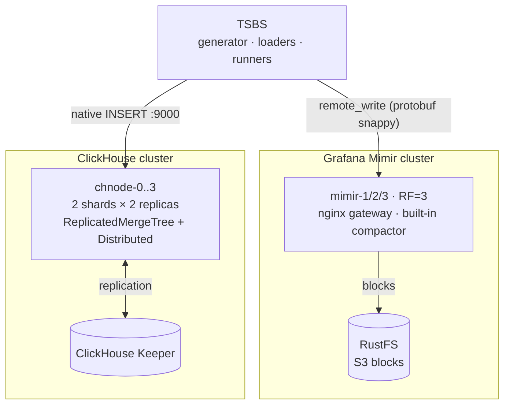

# Benchmark Mimir vs ClickHouse

Local sandbox to compare, under equivalent load, a Prometheus-compatible TSDB
(**Grafana Mimir**, clustered) and **ClickHouse** (clustered) on:

- **write speed** (ingestion),
- **read speed** (queries),
- **maintenance operations**: compaction, replication and **replica rebuild**.

The benchmark engine is [TSBS](https://github.com/timescale/tsbs) (use-case `cpu-only`),
which generates **a single dataset** injected into both systems for a fair comparison.

## The experiment

One dataset, generated once by TSBS (`cpu-only`, 10,000 hosts, 30 hours at a 10s interval),
loaded into both systems: a ClickHouse cluster (2 shards, 2 replicas each, plus one Keeper node)
and a Mimir cluster (3 monolithic replicas, replication factor 3, with RustFS as the S3 object
store). TSBS was compiled from source inside the cluster, so no private registry was involved.

### Test environment

A single Talos Linux node acting as both control plane and worker (no taint, so workloads
schedule on it). It is a shared cluster: dozens of other namespaces were live during the run
(ArgoCD, KubeVirt, SigNoz, monitoring, and so on), so the benchmark did not have the machine to
itself.

| Property | Value |
|---|---|
| Kubernetes | v1.35.6 |
| OS | Talos Linux v1.13.5 |
| Kernel | 6.18.36-talos |
| Container runtime | containerd 2.2.5 |
| Architecture | amd64 |
| CNI | Cilium (with cilium-envoy and cilium-operator) |
| CPU | 12 vCPU |
| Memory | 125.7 GiB |
| Ephemeral storage | 417.8 GiB |

The benchmark was driven from a macOS laptop over `kubectl`. TSBS ran inside its pod, launched
detached with `setsid` so the long generation and ingestion steps survived any `kubectl exec`
disconnection. The ClickHouse cluster operations were driven from the laptop too, since they
need `kubectl` to reach individual pods.

**Storage.** Every component uses `emptyDir` on the node's ephemeral disk. No persistence is
needed for a throwaway run, and it keeps the benchmark off the shared storage pool.

Software versions:

| Component | Version |
|---|---|
| ClickHouse server and Keeper | 24.8 |
| Grafana Mimir | 2.13.0 |
| RustFS | latest |
| `minio/mc` (bucket init) | latest |
| TSBS | built from `master` (Go 1.22, bookworm) |
| busybox (init container) | 1.36 |

Deployed components, all under the `bench-prom-ch` namespace (labelled `privileged` for Pod
Security):

| Component | Pods | CPU request | CPU limit | Mem limit | Working dir (emptyDir) |
|---|---|---|---|---|---|
| ClickHouse (`chnode`) | 4 | 500m | 3 | 8 GiB | 40 GiB |
| ClickHouse Keeper | 1 | 100m | 1 | 1 GiB | 5 GiB |
| Mimir | 3 | 500m | 3 | 16 GiB | 60 GiB |
| RustFS | 1 | 100m | 2 | 4 GiB | 30 GiB |
| TSBS | 1 | 500m | 6 | 10 GiB | 40 GiB |

Mimir ran with replication factor 3, memberlist for its rings, a 40h out-of-order window, and
(after the read fix) its per-query fetch limits set to unlimited. ClickHouse ran as 2 shards of
2 replicas, coordinated by the single Keeper node, with the legacy `MergeTree` syntax allowed so
the TSBS schema would load. Pod CPU, memory, network and filesystem metrics came from the
cluster's existing `signoz-k8s-infra` OTel collector, queried through SigNoz.

## Results

All figures are for the same 1.08 billion points (108 million rows, 10 metrics per row).

### Write

| | ClickHouse | Mimir |
|---|---|---|
| Duration | 277 s | 5,270 s (87.8 min) |
| Throughput | 3.90 M points/s | 205 k points/s |

ClickHouse ingested the whole dataset about 19 times faster. This is a backfill of historical
data, close to a worst case for a pull-based TSDB. Real-time ingestion, where Mimir compacts and
ships continuously, would look kinder to it.

### Storage

| | ClickHouse (one copy) | Mimir (RustFS blocks) |
|---|---|---|
| On disk | 2.88 GiB (4.4x compression) | 6.0 GiB |

Different durability models, so read this loosely: ClickHouse replicates across the cluster at
RF=2, while Mimir keeps one compacted copy in object storage with durability handled by S3.

### Resource consumption during the write (from SigNoz)

| | ClickHouse cluster | Mimir cluster |
|---|---|---|
| Average CPU | ~2.0 cores | ~5.5 cores |
| Peak memory | ~1.0 GiB (busiest node) | ~0.79 GiB per pod |
| CPU-time to ingest | ~560 core-seconds | ~28,700 core-seconds |

For the same data, Mimir spent roughly 51 times more CPU-time than ClickHouse. Part of that is
the ingestion protocol (remote-write with protobuf and replication factor 3), part is the
out-of-order backfill.

### Read (mirrored queries, correct metric names, 100,000 hosts)

| Query | Mimir | ClickHouse | Gap |
|---|---|---|---|
| Single series (1 host, 1 metric, 1h) | 7 ms | 6 ms | tie |
| 1 metric, all hosts (1h) | 817 ms | 211 ms | CH 3.9x |
| 1 metric, all hosts (4h) | 2,705 ms | 361 ms | CH 7.5x |
| 10 metrics, all hosts (1h) | not expressible in one PromQL query | 1,043 ms | CH only |

The gap widens as the window grows, because Mimir scales with the number of samples it has to
pull while ClickHouse stays roughly flat. The full ten-metric aggregation cannot be written as a
single PromQL query at all: range functions drop the `__name__` label, so the ten metrics
collapse into the same label set and the query errors. In SQL it is one `GROUP BY`. To even
attempt the wide queries, Mimir needed its per-query fetch limits set to unlimited. Those limits
exist precisely to stop this kind of analytical query from hurting a Prometheus store.

### ClickHouse cluster operations (108 million rows, replicated)

- `OPTIMIZE TABLE ... FINAL` across the cluster: 22 s.
- Rebuilding a wiped replica (drop the local copy, recreate it, refetch about 1.5 GiB of parts
  from its peer through Keeper): 6 s.

## Verdict

For bulk historical ingestion and analytical reads, ClickHouse won clearly: faster writes, far
less CPU, more compact storage, and it is the only one of the two that actually completes wide
aggregations. Mimir matched it on single-series lookups, which is the workload it is built for,
and there both answer in single-digit milliseconds.

None of this says Mimir is bad. It says the two tools are built for different jobs. Mimir is a
Prometheus-compatible metrics store for live monitoring and alerting at high series counts.
ClickHouse is an analytical database. Point a metrics workload at ClickHouse and you give up the
Prometheus ecosystem; point an analytics workload at Mimir and you hit its guard rails.

## Topology



| Component        | Role                                    | Host port |
|------------------|-----------------------------------------|-----------|
| `mimir-gw`       | nginx gateway (write + PromQL)          | 9009      |
| `chnode1`        | ClickHouse node (HTTP / native)         | 8123 / 9000 |
| `chnode2/3/4`    | Other ClickHouse nodes                  | 8124-8126 / 9001-9003 |
| `rustfs`         | S3 object storage for Mimir blocks      | 9100 (API) / 9101 (console) |
| `grafana`        | Visualization (`obs` profile)           | 3000      |

## Prerequisites

- Docker + Docker Compose v2.
- Copy `.env.example` to `.env` and set `OBJSTORE_SECRET_KEY` (the object-storage password for
  RustFS and Mimir). `.env` is gitignored.
- The **big** preset (~1 Bn points) is heavy: plan for **>= 16 GB of RAM** allocatable to
  Docker and **several tens of GB of disk** (RF=3 replication on the Mimir side, RF=2 on the
  ClickHouse side + gzipped data files). Start with `make smoke`.

## Quick start

```bash
make build      # builds the TSBS image (compiles the binaries from source)
make up         # starts both clusters + TSBS, then prints the CH topology
make smoke      # quick validation bench (SCALE=100, 3h, ~1M points)
```

Then the full benchmark (parameters in `.env`):

```bash
make bench      # generation -> write -> read -> cluster lab
make observe    # snapshot of merges (CH) and the compactor (Mimir)
make grafana    # optional: dashboards on http://localhost:3000
```

## On Kubernetes (recommended for the 1 Bn run)

The manifests are in `k8s/`: dedicated namespace `bench-prom-ch`, ClickHouse cluster
(StatefulSet `chnode-0..3` + Keeper), Mimir cluster (3-node StatefulSet, RF=3) with
**RustFS** as object storage, and a `tsbs` pod that compiles TSBS from source
(no private registry required). Volumes are `emptyDir` (sandbox, no PVC).

The same scripts drive the cluster via `RUNTIME=k8s` (switches `docker exec` → `kubectl exec`).

```bash
export KUBECONFIG=~/.kube/config       # your cluster
export OBJSTORE_SECRET_KEY=some-secret # object-storage password (see .env.example)
make k8s-up        # applies k8s/, creates the objstore-creds secret, waits for readiness
make k8s-smoke     # validation smoke (~1M points)
make k8s-bench     # full 1 Bn bench (parameters from .env)
make k8s-observe   # CH merges + Mimir compactor
make k8s-down      # removes the namespace (and the ephemeral volumes)
```

> Results and data files stay in the `tsbs` pod (`/workspace`). To
> retrieve them: `kubectl -n bench-prom-ch exec deploy/tsbs -- cat /workspace/results/<file>`.

### Resource consumption via SigNoz

The cluster exports pod metrics (`signoz-k8s-infra`, OTel collector) to SigNoz.
The comparison includes the **actual consumption per phase and per component** (ClickHouse vs
Mimir vs RustFS), correlated with the time windows recorded by the runner.

- The runner writes `results/phase_windows.tsv` (`epoch_ms <TAB> phase_name`) at each step.
- These windows are used to query SigNoz per phase, filtered on
  `k8s.namespace.name = 'bench-prom-ch'`, grouped by `k8s.pod.name`.
- Metrics used: `k8s.pod.cpu.usage` (cores), `k8s.pod.memory.working_set` (bytes),
  `k8s.pod.network.io` (throughput), `k8s.pod.filesystem.usage` (bytes).

Prerequisite: `signoz` MCP server connected with an API key of at least **Viewer** role
(otherwise the read endpoints return `403 only viewers/editors/admins`).

Individual steps (docker): `make generate | load | query | cluster`.

## Configuration (`.env`)

The target volume is tuned via `SCALE` (number of hosts = cardinality) and `DURATION_HOURS`:

> points ≈ `SCALE` × 10 × (`DURATION_HOURS` × 3600 / `LOG_INTERVAL`)

- **smoke**: `SCALE=100`, `DURATION_HOURS=3` → ~1 M points
- **big** (default): `SCALE=10000`, `DURATION_HOURS=30` → **~1.08 Bn points**

> `DURATION_HOURS` must exceed the query window (1 h for `single-groupby`),
> otherwise query generation fails. Keep `DURATION_HOURS >= 2`.

Other useful settings: `CH_WORKERS`/`PROM_WORKERS` (parallelism), `QUERY_TYPE`,
`QUERY_COUNT`, image versions.

## Two important subtleties (already handled)

1. **Mimir rejects samples that are too old.** Unlike VictoriaMetrics, Mimir
   (like Prometheus) refuses backfill outside its window. `scripts/01_generate.sh` **therefore
   anchors the time range on "now"** (`now - DURATION_HOURS` → `now`) and
   `mimir.yaml` opens `out_of_order_time_window: 40h`. To fix a precise range, set
   `TS_START`/`TS_END` in `.env` *and* increase the window accordingly (or use
   the loader's `--use-current-time` option, at the cost of the time dimension of the reads).

2. **TSBS has no `run_queries_prometheus`.** Mimir ingestion goes through
   `tsbs_load_prometheus` (remote_write). The TSBS ClickHouse loader
   creates a **single-node** schema: `clickhouse_cluster_ops.sh` then recreates the table as
   `ReplicatedMergeTree`/`Distributed` for the cluster part.

3. **Metric-name mismatch on the Mimir read path (invalidates TSBS reads).**
   `tsbs_load_prometheus` stores metrics WITHOUT the measurement prefix (`usage_user`),
   but the `victoriametrics` query generator targets `cpu_usage_*`. Mixing them makes every
   Mimir query match nothing (empty results in ~2 ms) — a silent, misleading "win". The
   authoritative cross-engine read comparison is therefore **`scripts/read_gradient.sh`**
   (`make read-gradient` / `make k8s-read`): hand-written, name-correct, mirrored PromQL/SQL
   along an index-escape gradient (single series → fan-out over all 100k series). It also
   requires Mimir's per-query fetch limits raised (set to unlimited in `k8s/20-mimir.yaml`).

## ClickHouse cluster operations lab

`scripts/clickhouse_cluster_ops.sh {setup|compaction|rebuild|status|all}`:

- **setup** — introspects the TSBS schema (`system.tables`/`system.columns`), recreates the table as
  `ReplicatedMergeTree` `ON CLUSTER` + a `Distributed` table, and copies the data
  (sharding across 2 shards + replication RF=2).
- **compaction** — measures the number of *parts* and the compression ratio **before/after**
  `OPTIMIZE … FINAL`, and shows the merges in progress (`system.merges`).
- **rebuild** — drops the replica `chnode2`'s copy (`DROP TABLE … SYNC`), recreates it, and
  **times the rebuild** from its peer via Keeper
  (`system.replicated_fetches`, `system.replication_queue`).

## Where to read the results

In `./results/`:

| File                        | Content                                  |
|-----------------------------|------------------------------------------|
| `load_clickhouse.txt`       | ClickHouse write throughput (rows/s, metrics/s) |
| `load_mimir.txt`            | Mimir write throughput                   |
| `query_clickhouse-*.txt`    | ClickHouse read latencies/throughput     |
| `query_mimir-*.txt`         | Mimir read latencies/throughput          |

At the end of a run TSBS prints the average throughput and the latency percentiles — that is the basis of
the comparison. On-disk storage and the compression ratio are printed by the
load scripts and by `make observe`.

## Cleanup

```bash
make down     # stops, keeps the volumes
make clean    # stops and REMOVES volumes + generated data/results
```

## Known limitations

- A single ClickHouse Keeper node (no coordinator HA) — enough for a sandbox.
- TSBS ClickHouse ingestion targets `chnode1` (single-node schema); sharding/replication is
  demonstrated by the cluster lab, not during the raw ingestion measurement.
- The TSBS flags can vary depending on `TSBS_REF`: they are centralized in `scripts/*.sh`.
