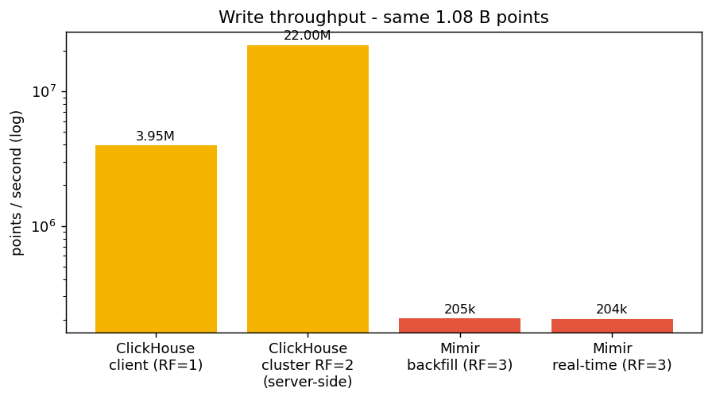
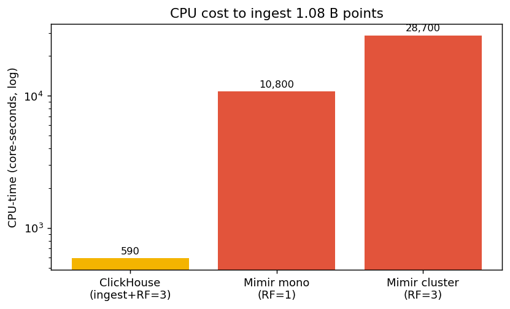
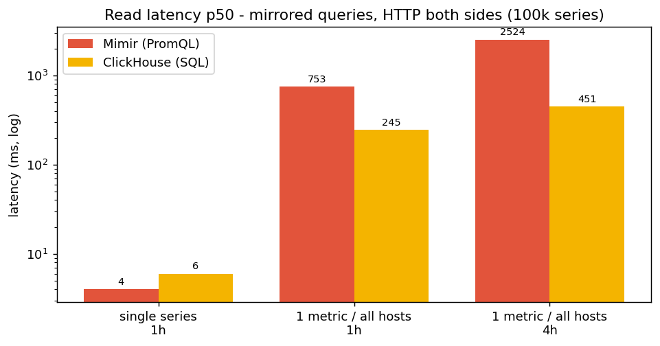
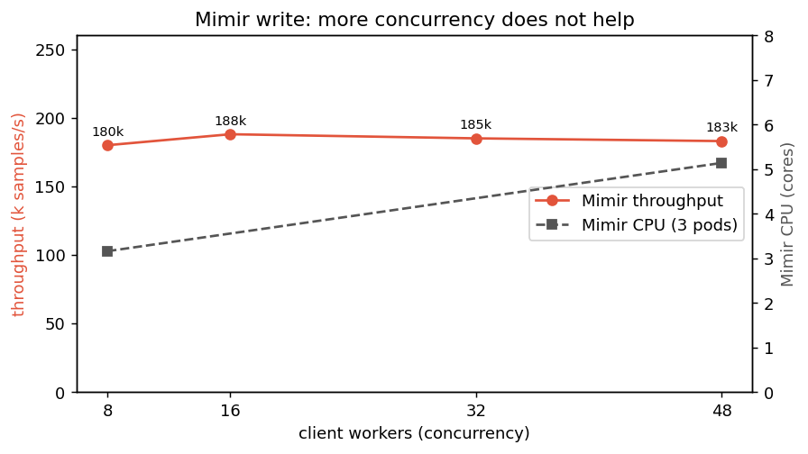
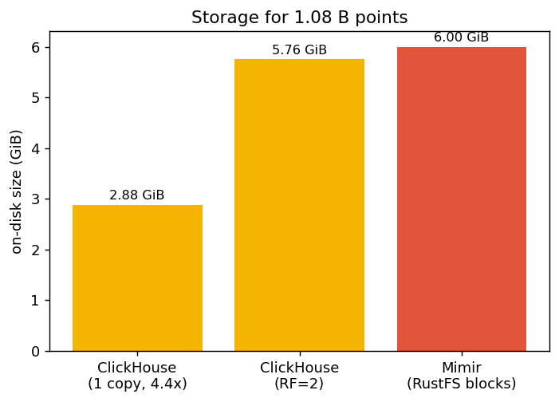
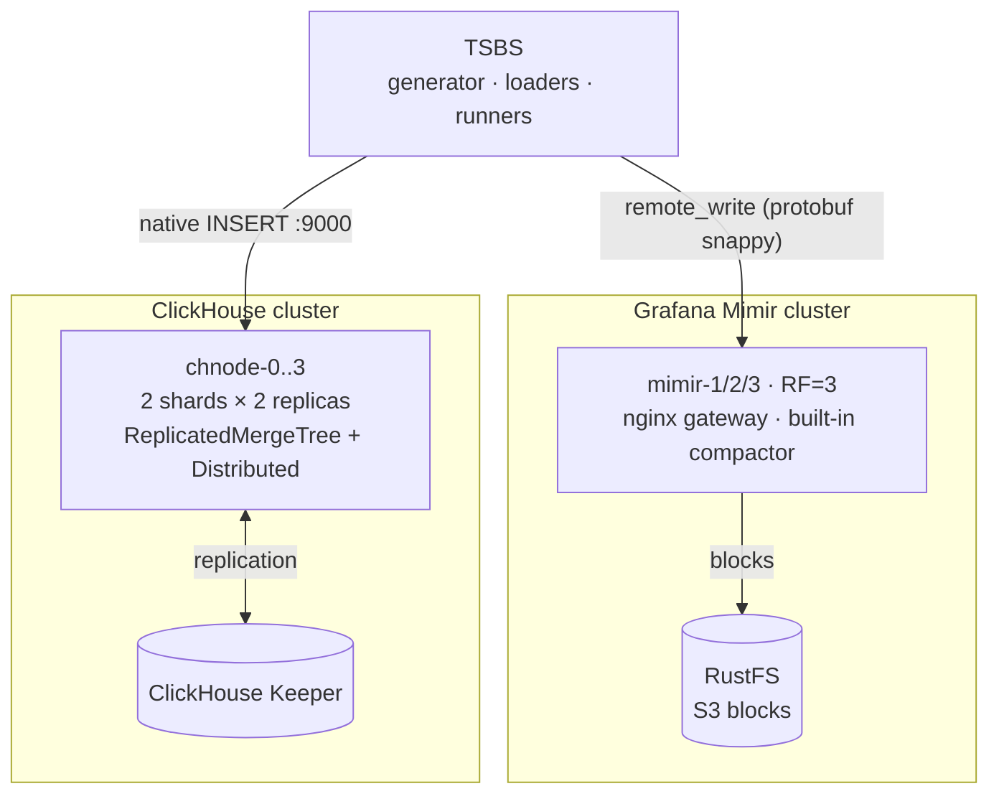

# Benchmark Mimir vs ClickHouse

Local sandbox to compare, under equivalent load, a Prometheus-compatible TSDB
(**Grafana Mimir**, clustered) and **ClickHouse** (clustered) on:

- **write speed** (ingestion),
- **read speed** (queries),
- **maintenance operations**: compaction, replication and **replica rebuild**.

The benchmark engine is [TSBS](https://github.com/timescale/tsbs) (use-case `cpu-only`),
which generates **a single dataset** injected into both systems for a fair comparison.

## The experiment

One dataset, generated once by TSBS (`cpu-only`, 10,000 hosts, 30 hours at a 10s interval),
loaded into both systems: a ClickHouse cluster (2 shards, 2 replicas each, plus one Keeper node)
and a Mimir cluster (3 monolithic replicas, replication factor 3, with RustFS as the S3 object
store). TSBS was compiled from source inside the cluster, so no private registry was involved.

### Test environment

A single Talos Linux node acting as both control plane and worker (no taint, so workloads
schedule on it). It is a shared cluster: dozens of other namespaces were live during the run
(ArgoCD, KubeVirt, SigNoz, monitoring, and so on), so the benchmark did not have the machine to
itself.

| Property | Value |
|---|---|
| Kubernetes | v1.35.6 |
| OS | Talos Linux v1.13.5 |
| Kernel | 6.18.36-talos |
| Container runtime | containerd 2.2.5 |
| Architecture | amd64 |
| CNI | Cilium (with cilium-envoy and cilium-operator) |
| CPU | 12 vCPU |
| Memory | 125.7 GiB |
| Ephemeral storage | 417.8 GiB |

The benchmark was driven from a macOS laptop over `kubectl`. TSBS ran inside its pod, launched
detached with `setsid` so the long generation and ingestion steps survived any `kubectl exec`
disconnection. The ClickHouse cluster operations were driven from the laptop too, since they
need `kubectl` to reach individual pods.

**Storage.** Every component uses `emptyDir` on the node's ephemeral disk. No persistence is
needed for a throwaway run, and it keeps the benchmark off the shared storage pool.

Software versions:

| Component | Version |
|---|---|
| ClickHouse server and Keeper | 24.8 |
| Grafana Mimir | 2.13.0 |
| RustFS | latest |
| `minio/mc` (bucket init) | latest |
| TSBS | built from `master` (Go 1.22, bookworm) |
| busybox (init container) | 1.36 |

Deployed components, all under the `bench-prom-ch` namespace (labelled `privileged` for Pod
Security):

| Component | Pods | CPU request | CPU limit | Mem limit | Working dir (emptyDir) |
|---|---|---|---|---|---|
| ClickHouse (`chnode`) | 4 | 500m | 3 | 8 GiB | 40 GiB |
| ClickHouse Keeper | 1 | 100m | 1 | 1 GiB | 5 GiB |
| Mimir | 3 | 500m | 3 | 16 GiB | 60 GiB |
| RustFS | 1 | 100m | 2 | 4 GiB | 30 GiB |
| TSBS | 1 | 500m | 6 | 10 GiB | 40 GiB |

Mimir ran with replication factor 3, memberlist for its rings, a 40h out-of-order window, and
(after the read fix) its per-query fetch limits set to unlimited. ClickHouse ran as 2 shards of
2 replicas, coordinated by the single Keeper node, with the legacy `MergeTree` syntax allowed so
the TSBS schema would load. Pod CPU, memory, network and filesystem metrics came from the
cluster's existing `signoz-k8s-infra` OTel collector, queried through SigNoz.

## Results

All figures are for the same 1.08 billion points (108 million rows, 10 metrics per row).

### Charts

Generated by `scripts/plots.py` (matplotlib) from the measured numbers.

| | |
|---|---|
|  |  |
|  |  |
|  | |

### Write

Measured paths for the same 1.08 billion points:

| Path | Duration | Throughput | Replication |
|---|---|---|---|
| ClickHouse, client ingest (TSBS) | 273 s | 3.95 M points/s | single node, RF=1 |
| ClickHouse, cluster write (INSERT SELECT into Distributed) | +48 s | ~22 M points/s (server-side) | 2 shards, RF=2 |
| Mimir, backfill (out-of-order) | 5,270 s | 205 k points/s | 3 nodes, RF=3 |
| Mimir, real-time (append at head) | 5,292 s | 204 k points/s | 3 nodes, RF=3 |
| Mimir, single instance (monolithic) | 3,645 s | 296 k points/s | 1 instance, RF=1 |

Read the ClickHouse and Mimir rows with the asymmetry in mind (see Caveats): the ClickHouse
client path is single node at RF=1, and its cluster write is a server-side INSERT SELECT with no
client protocol, while Mimir ingests over remote-write at RF=3. So a bare "19x" is not a
like-for-like number. Two findings hold regardless of that asymmetry:

- **Mimir's throughput ceiling is not an out-of-order artifact.** Real-time append (204 k/s) and
  historical backfill (205 k/s) land within 0.5% of each other. Out-of-order only cost memory:
  the first backfill ballooned the ingester working set and was evicted at 20 GiB, which is why
  the working directory is now 60 GiB. The real-time run had a flat head and zero restarts.
- **More client concurrency does not raise the ceiling.** A sweep at 8, 16, 32 and 48 workers
  stayed flat around 180-188 k samples/s while Mimir's own CPU climbed from ~3.2 to ~5.1 cores.
  Extra concurrency buys CPU burn, not throughput. The wall is server side: ingester CPU plus the
  RF=3 write amplification (every sample stored three times). Scaling Mimir writes means more
  ingester and distributor replicas, not more clients.

Adding full RF=2 sharding and replication to ClickHouse costs only ~48 s of server-side work on
top of the ingest, so even a replicated ClickHouse finishes the volume in minutes rather than the
~88 minutes Mimir takes at RF=3.

### Storage

| | ClickHouse (one copy) | Mimir (RustFS blocks) |
|---|---|---|
| On disk | 2.88 GiB (4.4x compression) | 6.0 GiB |

Different durability models, so read this loosely: ClickHouse replicates across the cluster at
RF=2, while Mimir keeps one compacted copy in object storage with durability handled by S3.

### Resource consumption during the write (from SigNoz)

| | ClickHouse | Mimir |
|---|---|---|
| CPU, client ingest (single node) | ~1.45 cores on the busiest node | not applicable |
| CPU, cluster write | ~2.3 cores across 4 nodes (RF=2 INSERT SELECT) | ~5.5 cores across 3 pods |
| Peak memory | ~1.0 GiB (busiest node) | ~0.9 GiB per pod |
| CPU-time for the full dataset | ~500 core-seconds (ingest + RF=2 replicate) | ~28,700 core-seconds (RF=3) |

Mimir spent roughly 50x more CPU-time than ClickHouse for the same data. The replication factor
(3 vs 2) explains only about 1.5x of that. The rest is architectural: the per-sample remote-write
path (protobuf, RF fan-out, TSDB head) against columnar batch inserts.

To separate the cost of clustering from the engine itself, a single-instance monolithic Mimir
(RF=1, no gossip) was also run: it ingested at 296 k/s using ~10,800 core-seconds, versus the
3-node RF=3 cluster's 205 k/s and ~28,700 core-seconds. So dropping clustering and RF=3 makes
Mimir about 1.4x faster and ~2.6x cheaper, but it is still ~22x the CPU-time of ClickHouse. Most
of the gap is the engine and protocol, not the cluster. (See `k8s/40-mimir-mono.yaml`.)

### Continuous ingestion and ClickHouse's merge tax

The bulk write above uses large batches, a best case for ClickHouse: few parts, little merging.
A metrics-like continuous stream is many small writes, which create many small parts that
ClickHouse then merges in the background. Loading the same 1.44M-row slice both ways
(`scripts/merge_tax.sh`):

| Batch size | Wall time | Parts created | Merges | Merge CPU-time |
|---|---|---|---|---|
| 10,000 (bulk) | 4 s | 144 | 25 | 2.8 s |
| 200 (scrape-like) | 16 s | 7,344 | 1,257 | 29 s |

Small batches create ~50x more parts and ~10x more merge work, and the load is ~4x slower. So the
headline bulk write numbers understate ClickHouse's steady-state cost under continuous small-write
ingestion. It is still faster than Mimir here (about 900k vs 205k points/s even at batch=200), but
the gap narrows and the background merge CPU is real. A real metrics deployment would tune
`batch-size` and `async_insert`.

### Read (mirrored queries, correct metric names, 10,000 hosts / 100k series)

Both engines timed the same way: over HTTP, including result serialization and transfer (Mimir
`query_range`/JSON, ClickHouse HTTP interface with `FORMAT JSONCompact`). p50/p95 in ms over 10
runs after 2 warm-ups. See `scripts/read_gradient.sh`.

| Query | Mimir (p50/p95) | ClickHouse (p50/p95) | Gap (p50) |
|---|---|---|---|
| Single series (1 host, 1 metric, 1h) | 4 / 6 ms | 6 / 7 ms | tie |
| 1 metric, all hosts (1h) | 753 / 817 ms | 245 / 334 ms | CH ~3.1x |
| 1 metric, all hosts (4h) | 2,524 / 2,610 ms | 451 / 565 ms | CH ~5.6x |
| 10 metrics, all hosts (1h) | not expressible in one PromQL query | ~1 s | CH only |

(Mimir figures are with its memcached caches enabled, see below.)

The gap widens as the window grows, because Mimir scales with the number of samples it has to
pull while ClickHouse stays roughly flat. The full ten-metric aggregation cannot be written as a
single PromQL query at all: range functions drop the `__name__` label, so the ten metrics
collapse into the same label set and the query errors. In SQL it is one `GROUP BY`. To even
attempt the wide queries, Mimir needed its per-query fetch limits set to unlimited. Those limits
exist precisely to stop this kind of analytical query from hurting a Prometheus store.

Mimir runs with its memcached caches enabled (results, chunks, index; added to give it a fair
shot). Measured, they only shaved a few percent off the wide-scan latency: the bottleneck there
is query evaluation and JSON serialization of ~6M points, not block I/O from object storage,
which the caches address. Both engines also query single-node data here (a Distributed ClickHouse
read on this one physical node was actually slower, see Caveats). The direction holds either way:
a tie on single-series lookups, ClickHouse ahead on wide aggregations.

### Leveraging engine optimizations (ClickHouse rollup)

The comparison above uses raw tables on both sides. Each engine has a pre-aggregation tool that
the raw baseline skips. A ClickHouse materialized-view-style rollup (1-minute `AggregatingMergeTree`,
`scripts/ch_rollup.sh`) on an "avg per host" query:

| Query | raw `cpu` | rollup `cpu_1m` |
|---|---|---|
| 4h window (scan ~14M vs ~2.4M) | 165 ms | 220 ms |
| full 30h range (scan 108M vs 18M) | 337 ms | 230 ms |

The rollup helps on large scans (~1.5x on the full range) but not on small windows, where
ClickHouse's raw columnar scan is already fast enough that the aggregate-state overhead makes it
slower.

Mimir's counterpart is recording rules (`scripts/mimir_rule.sh`): a rule that pre-computes
`avg_over_time(usage_user[1m])` every minute, the same temporal downsampling as the ClickHouse
rollup. The rule loads and evaluates cleanly (health "ok"), but recording rules only pre-compute
going forward, and on this single-node deployment the freshly-fed current-time data was not
reliably queryable back (the recent-data vs blocks gap in the caveats), so the recorded-read
comparison could not be completed. Mechanically it is the right analog; a steady-state multi-hour
deployment would let it pay off like the rollup does.

The point stands either way: both engines have headroom via pre-aggregation, so the raw numbers
are a floor, not a ceiling.

### ClickHouse cluster operations (108 million rows, replicated)

- `OPTIMIZE TABLE ... FINAL` across the cluster: 22 s.
- Rebuilding a wiped replica (drop the local copy, recreate it, refetch about 1.5 GiB of parts
  from its peer through Keeper): 6 s.

## Caveats

These numbers come from a sandbox, not a controlled lab. Known limits that bound how far to trust
the ratios:

- **ClickHouse client ingest is single node, RF=1.** Stock TSBS cannot drive a clustered
  ClickHouse client load: its loader derives the tag column list only while creating its own
  tables, so it cannot target pre-made Distributed tables. The RF=2 sharded+replicated write is
  therefore measured separately as a server-side `INSERT SELECT`, which pays no client protocol.
- **Reads are single-shot and timed asymmetrically** (ClickHouse server-time versus Mimir full
  HTTP+JSON). Order-of-magnitude only.
- **Shared node.** A single 12 vCPU Talos node running dozens of other namespaces, at roughly 80%
  CPU during the runs. cgroup throttling is possible and was not isolated.
- **Everything on one physical node, which penalizes Mimir more than ClickHouse.** Mimir is built
  to scale horizontally: on a real cluster its three RF=3 ingesters would sit on separate machines,
  spreading the 3x write amplification across 3x the hardware. Stacked on one 12 vCPU box they
  contend for the same CPU, plus gossip/gRPC overhead that assumes a network. ClickHouse needs no
  scale-out to perform (it used ~1 core). So the **throughput** ratios (the "19x" write) are the
  numbers most likely to narrow on real multi-node hardware, where Mimir would scale up. The
  **efficiency** ratios (CPU-time per sample ~50x, storage) are architectural and largely
  node-count independent, so they are the more portable figures. Related, measured: a Distributed
  ClickHouse read on this single node was *slower* than the single-node table (overhead without
  real parallelism), so the mono-node ClickHouse reads reported here are its best case on this box,
  not a handicap.
- **RustFS is one replica on `emptyDir`.** The "durability via S3" framing is nominal here.
- **Storage was read shortly after ingest**, so Mimir blocks may not be fully compacted.
- **Ops testing is one-sided:** ClickHouse compaction and replica rebuild are exercised; there is
  no equivalent Mimir test (ingester loss, WAL replay, store-gateway restart).
- **Raw baseline, no engine-specific optimizations.** Neither side uses its pre-aggregation
  tooling: no ClickHouse materialized views / AggregatingMergeTree, no Mimir recording rules.
  Both would speed up the aggregation reads; this is a deliberate apples-to-apples floor, not each
  engine's tuned ceiling.
- **Write figures are one-shot bulk (large batches).** Continuous small-write ingestion shifts
  cost into ClickHouse background merges (see "the merge tax" above); a steady-state multi-day run
  was not modeled.

## Verdict

For bulk ingestion and analytical reads, ClickHouse won clearly: much faster and far cheaper
writes, more compact storage, and it is the only one of the two that actually completes wide
aggregations. Mimir's ~205 k samples/s write ceiling is real, not an out-of-order or
client-concurrency artifact (real-time and backfill matched, and adding workers did not help).
Mimir matched ClickHouse on single-series lookups, which is the workload it is built for, and
there both answer in single-digit milliseconds.

None of this says Mimir is bad. It says the two tools are built for different jobs. Mimir is a
Prometheus-compatible metrics store for live monitoring and alerting at high series counts.
ClickHouse is an analytical database. Point a metrics workload at ClickHouse and you give up the
Prometheus ecosystem; point an analytics workload at Mimir and you hit its guard rails.

## Topology



| Component        | Role                                    | Host port |
|------------------|-----------------------------------------|-----------|
| `mimir-gw`       | nginx gateway (write + PromQL)          | 9009      |
| `chnode1`        | ClickHouse node (HTTP / native)         | 8123 / 9000 |
| `chnode2/3/4`    | Other ClickHouse nodes                  | 8124-8126 / 9001-9003 |
| `rustfs`         | S3 object storage for Mimir blocks      | 9100 (API) / 9101 (console) |
| `grafana`        | Visualization (`obs` profile)           | 3000      |

## Prerequisites

- Docker + Docker Compose v2.
- Copy `.env.example` to `.env` and set `OBJSTORE_SECRET_KEY` (the object-storage password for
  RustFS and Mimir). `.env` is gitignored.
- The **big** preset (~1 Bn points) is heavy: plan for **>= 16 GB of RAM** allocatable to
  Docker and **several tens of GB of disk** (RF=3 replication on the Mimir side, RF=2 on the
  ClickHouse side + gzipped data files). Start with `make smoke`.

## Quick start

```bash
make build      # builds the TSBS image (compiles the binaries from source)
make up         # starts both clusters + TSBS, then prints the CH topology
make smoke      # quick validation bench (SCALE=100, 3h, ~1M points)
```

Then the full benchmark (parameters in `.env`):

```bash
make bench      # generation -> write -> read -> cluster lab
make observe    # snapshot of merges (CH) and the compactor (Mimir)
make grafana    # optional: dashboards on http://localhost:3000
```

## On Kubernetes (recommended for the 1 Bn run)

The manifests are in `k8s/`: dedicated namespace `bench-prom-ch`, ClickHouse cluster
(StatefulSet `chnode-0..3` + Keeper), Mimir cluster (3-node StatefulSet, RF=3) with
**RustFS** as object storage, and a `tsbs` pod that compiles TSBS from source
(no private registry required). Volumes are `emptyDir` (sandbox, no PVC).

The same scripts drive the cluster via `RUNTIME=k8s` (switches `docker exec` → `kubectl exec`).

```bash
export KUBECONFIG=~/.kube/config       # your cluster
export OBJSTORE_SECRET_KEY=some-secret # object-storage password (see .env.example)
make k8s-up        # applies k8s/, creates the objstore-creds secret, waits for readiness
make k8s-smoke     # validation smoke (~1M points)
make k8s-bench     # full 1 Bn bench (parameters from .env)
make k8s-observe   # CH merges + Mimir compactor
make k8s-down      # removes the namespace (and the ephemeral volumes)
```

> Results and data files stay in the `tsbs` pod (`/workspace`). To
> retrieve them: `kubectl -n bench-prom-ch exec deploy/tsbs -- cat /workspace/results/<file>`.

### Resource consumption via SigNoz

The cluster exports pod metrics (`signoz-k8s-infra`, OTel collector) to SigNoz.
The comparison includes the **actual consumption per phase and per component** (ClickHouse vs
Mimir vs RustFS), correlated with the time windows recorded by the runner.

- The runner writes `results/phase_windows.tsv` (`epoch_ms <TAB> phase_name`) at each step.
- These windows are used to query SigNoz per phase, filtered on
  `k8s.namespace.name = 'bench-prom-ch'`, grouped by `k8s.pod.name`.
- Metrics used: `k8s.pod.cpu.usage` (cores), `k8s.pod.memory.working_set` (bytes),
  `k8s.pod.network.io` (throughput), `k8s.pod.filesystem.usage` (bytes).

Prerequisite: `signoz` MCP server connected with an API key of at least **Viewer** role
(otherwise the read endpoints return `403 only viewers/editors/admins`).

Individual steps (docker): `make generate | load | query | cluster`.

## Configuration (`.env`)

The target volume is tuned via `SCALE` (number of hosts = cardinality) and `DURATION_HOURS`:

> points ≈ `SCALE` × 10 × (`DURATION_HOURS` × 3600 / `LOG_INTERVAL`)

- **smoke**: `SCALE=100`, `DURATION_HOURS=3` → ~1 M points
- **big** (default): `SCALE=10000`, `DURATION_HOURS=30` → **~1.08 Bn points**

> `DURATION_HOURS` must exceed the query window (1 h for `single-groupby`),
> otherwise query generation fails. Keep `DURATION_HOURS >= 2`.

Other useful settings: `CH_WORKERS`/`PROM_WORKERS` (parallelism), `QUERY_TYPE`,
`QUERY_COUNT`, image versions.

## Two important subtleties (already handled)

1. **Mimir rejects samples that are too old.** Unlike VictoriaMetrics, Mimir
   (like Prometheus) refuses backfill outside its window. `scripts/01_generate.sh` **therefore
   anchors the time range on "now"** (`now - DURATION_HOURS` → `now`) and
   `mimir.yaml` opens `out_of_order_time_window: 40h`. To fix a precise range, set
   `TS_START`/`TS_END` in `.env` *and* increase the window accordingly (or use
   the loader's `--use-current-time` option, at the cost of the time dimension of the reads).
   The computed range is persisted to `data/timerange.env` at generation time and reused by
   query generation, so the query window matches the data even though loading takes a long time
   between the two steps.

2. **TSBS has no `run_queries_prometheus`.** Mimir ingestion goes through
   `tsbs_load_prometheus` (remote_write). The TSBS ClickHouse loader
   creates a **single-node** schema: `clickhouse_cluster_ops.sh` then recreates the table as
   `ReplicatedMergeTree`/`Distributed` for the cluster part.

3. **Metric-name mismatch on the Mimir read path (invalidates TSBS reads).**
   `tsbs_load_prometheus` stores metrics WITHOUT the measurement prefix (`usage_user`),
   but the `victoriametrics` query generator targets `cpu_usage_*`. Mixing them makes every
   Mimir query match nothing (empty results in ~2 ms), a silent, misleading "win". The
   authoritative cross-engine read comparison is therefore **`scripts/read_gradient.sh`**
   (`make read-gradient` / `make k8s-read`): hand-written, name-correct, mirrored PromQL/SQL
   along an index-escape gradient (single series → fan-out over all 100k series). It also
   requires Mimir's per-query fetch limits raised (set to unlimited in `k8s/20-mimir.yaml`).

## ClickHouse cluster operations lab

`scripts/clickhouse_cluster_ops.sh {setup|compaction|rebuild|status|all}`:

- **setup**: introspects the TSBS schema (`system.tables`/`system.columns`), recreates the table as
  `ReplicatedMergeTree` `ON CLUSTER` + a `Distributed` table, and copies the data
  (sharding across 2 shards + replication RF=2).
- **compaction**: measures the number of *parts* and the compression ratio **before/after**
  `OPTIMIZE … FINAL`, and shows the merges in progress (`system.merges`).
- **rebuild**: drops the replica `chnode2`'s copy (`DROP TABLE … SYNC`), recreates it, and
  **times the rebuild** from its peer via Keeper
  (`system.replicated_fetches`, `system.replication_queue`).

## Where to read the results

In `./results/`:

| File                        | Content                                  |
|-----------------------------|------------------------------------------|
| `load_clickhouse.txt`       | ClickHouse write throughput (rows/s, metrics/s) |
| `load_mimir.txt`            | Mimir write throughput                   |
| `query_clickhouse-*.txt`    | ClickHouse read latencies/throughput     |
| `query_mimir-*.txt`         | Mimir read latencies/throughput          |

At the end of a run TSBS prints the average throughput and the latency percentiles, that is the basis of
the comparison. On-disk storage and the compression ratio are printed by the
load scripts and by `make observe`.

## Cleanup

```bash
make down     # stops, keeps the volumes
make clean    # stops and REMOVES volumes + generated data/results
```

## Known limitations

- A single ClickHouse Keeper node (no coordinator HA), enough for a sandbox.
- TSBS ClickHouse ingestion targets `chnode1` (single-node schema); sharding/replication is
  demonstrated by the cluster lab, not during the raw ingestion measurement.
- The TSBS flags can vary depending on `TSBS_REF`: they are centralized in `scripts/*.sh`.
